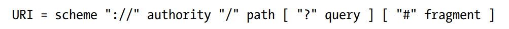

# REST API URI Design Rules
## Clarifying Some Buzz Words
- ***Web server*** is a term used to refer to software programs that accept, process and respond to HTTP (or its secure variant HTTPS) requests, as well as the underlying hardware (i.e. the physical machine) that makes this possible. 
- A ***web service*** is a purpose-built web server that provides functionalities and access to resources that support the needs of a site or any other application.
- An ***application programming interface (API)***, or more specifically a ***web API***, is the face of a web service, facilitating communication between client programs and the web service.
- A web API that conforms to the **Representational State Transfer (REST)** architectural style is a called a ***REST API***.
- When the web API that exposes a web service conforms the REST architectural style (i.e. it is a REST API), the web service is said to be a ***RESTful service***.

## A Little Bit of History
In 1993, Roy Fielding and others proposed a set of constraints grouped into six categories and collectively referred to
as the **Web's architectural style**. The six categories are:
1. Client-server
2. Uniform interface
3. Layered system
4. Cache
5. Stateless
6. Code-on-demand

In 2000, Fielding named and described the Web’s architectural style in his Ph.D. dissertation, giving it the name **Representational State Transfer (REST)**.

In the **uniform interface** category, one of the four constraints Fielding named is the ***identification of resources***, which is the idea that each distinct Web-based concept (i.e. resource) should be addressed by a unique identifier, one of which is a ***uniform resource identifier (URI)***.

In this context, a ***uniform resource identifier*** is a unique sequence of characters that identifies a Web-based concept or resource. REST APIs use URIs to address resources.

## Format of a URI
The image below shows the generic syntax of a URI:



Of the five URI segments, three (authority, path and query) will be dicussed in this note.

# URI Design Rules

## I. General URI Design Rules
1. Forward slash separator (/) *must* be used to indicate a hierarchical relationship between resources.
2. A trailing forward slash (/) *should* not be included in URIs. As the last character within a URI’s path, a forward slash (/) adds no semantic value and may cause confusion. REST APIs should not expect a trailing slash and should not include them in the links that they provide to clients.
3. Hyphens (-) *should* be used to improve the readability of URIs. Anywhere you would use a space or hyphen in English, you should use a hyphen in a URI.
4. Underscores (\_) *should* not be used in URIs. Depending on the application’s font, the underscore
(\_) character can either get partially obscured or completely hidden by this underlining. To avoid this confusion, use hyphens (-) instead of underscores.
5. Lowercase letters *should* be preferred in URI paths. When convenient, lowercase letters are preferred in URI paths since capital letters can sometimes cause problems.
6. File extensions *should* not be included in URIs. A REST API should not include artificial file extensions
in URIs to indicate the format of a message’s entity body. Instead, they should rely on the media type, as communicated through the Content-Type header, to determine how to process the body’s content. 

## II. URI Authority Design Rules
7.  Consistent subdomain names *should* be used for your APIs. The top-level domain and first subdomain names of an API should identify its service owner. The full domain name of an API should add a subdomain named `api`.
8. Consistent subdomain names *should* be used for your client developer portal. If an API provides a developer portal, by convention it should have a
subdomain labeled `developer`.
## III. URI Path Design Rules
### Resource Models
The URI path conveys a REST API’s resource model, with each forward slash separated path segment corresponding to a unique resource within the model’s hierarchy. When modeling an API’s resources, we can start with the some basic resource archetypes. A REST API is composed of four distinct resource archetypes: `document`, `collection`, `store`, and `controller`.

A. `document` - A document resource is a singular concept that is akin to an object instance or database record. A document’s state representation typically includes both fields with values and links to other related resources. With its fundamental field and link-based structure, the document type is the conceptual base archetype of the other resource archetypes.
In other words, the three other resource archetypes can be viewed as specializations of
the document archetype. A document may have child resources that represent its specific subordinate concepts.

B. `collection` - A collection resource is a *server-managed* directory of resources. A collection resource chooses what it wants to contain and also decides the URIs of each contained resource.

C. `store` - A store is a *client-managed* resource repository. A store resource lets an API client put resources in, get them back out, and decide when to delete them. On their own, stores do not create new resources; therefore a store never generates new URIs. Instead, each
stored resource has a URI that was chosen by a client when it was initially put into the
store.

D. `controller` - A controller resource models a procedural concept. Controller resources are like executable functions, with parameters and return values; inputs and outputs. Like a traditional web application’s use of HTML forms, a REST API relies on controller resources to perform application-specific actions that cannot be logically mapped to one of the standard methods CRUD. Controller names typically appear as the last segment in a URI path, with no child resources to follow them in the hierarchy.

For example, in
```
http://api.soccer.restapi.org/leagues/seattle/teams/trebuchet/players/12345/games/210/delete
```
- `http://api.soccer.restapi.org` is the REST API's entry point. It is a `document` which serves as the parent for all of the API's resources, its root resource, or its ***docroot***.
- `http://api.soccer.restapi.org/leagues/seattle`, `http://api.soccer.restapi.org/leagues/seattle/teams/trebuchet/` and `http://api.soccer.restapi.org/leagues/seattle/teams/trebuchet/players/12345` are also `document` types.
- `http://api.soccer.restapi.org/leagues/seattle/teams` and `http://api.soccer.restapi.org/leagues/seattle/teams/trebuchet/players` are `collection` types.
- `http://api.soccer.restapi.org/leagues/seattle/teams/trebuchet/players/12345/games` is a `store` type, "belonging" to the player with ID 12345.
- `http://api.soccer.restapi.org/leagues/seattle/teams/trebuchet/players/12345/games/210/delete` is a `controller` type, modelling the functionality of deleting one of a player's games.

9. A singular noun should be used for document names. A URI representing a document resource should be named with a singular noun or noun phrase path segment.

10. A plural noun should be used for collection names. A URI identifying a collection should be named with a plural noun, or noun phrase, path segment. A collection’s name should be chosen to reflect what it uniformly contains.

11. A plural noun should be used for store names. A URI identifying a store of resources should be named with a plural noun, or noun phrase, as its path segment. 

12. A verb or verb phrase should be used for controller names. Like a computer program’s function, a URI identifying a controller resource should be named to indicate its action.

13. Variable path segments may be substituted with identity-based values. Some URI path segments are static; meaning they have fixed names that may be chosen by the REST API’s designer. Other URI path segments are variable, which means that they are to be filled in with some identifier that will help provide the URI with its uniqueness. The ***URI Template syntax*** allows the naming of both static and variable segments. A URI template, such as:
```
http://api.soccer.restapi.org/leagues/{leagueId}/teams/{teamId}/players/{playerId}
```
includes variables that must be substituted before resolution, and each substitution should use a numeric or alphanumeric identifier, such as:
```
http://api.soccer.restapi.org/games/3fd65a60-cb8b-11e0-9572-0800200c9a66 
```

14. CRUD function names should not be used in URIs. URIs should not be used to indicate that a CRUD function is performed. URIs should be used to uniquely identify resources, and they should be named as described in the rules above. Instead, HTTP request methods should be used to indicate which CRUD function is performed.
For example, 
```
DELETE /users/1234
```
is preferrable than any of
```
GET /deleteUser?id=1234
GET /deleteUser/1234
DELETE /deleteUser/1234
POST /users/1234/delete
```

## IV. URI Query Design Rules
As a component of a URI, the query contributes to the unique identification of a resource.The query component of a URI contains a set of parameters to be interpreted as a variation or derivative of the resource that is hierarchically identified by the path component. So, while the following two resources are closely related, they are not the same:
```
http://api.college.restapi.org/students/morgan/send-sms
```
```
http://api.college.restapi.org/students/morgan/send-sms?text=hello
```
16. The query component of a URI *may* be used to filter collections or stores. For example,
```
GET /users 
```
returns a listing of all the users in the collection, while,
```
GET /users?role=admin
```
returns a filtered list of all the users in the collection with a `role` value of `admin`.

17. The query component of a URI should be used to paginate collection or store results. For example:
```
GET /users?pageSize=25&pageStartIndex=50
```
allows a REST API client to retrieve a maximum of 25 elements starting from the 50th.

## Sources
- Massé, Mark. REST API Design Rulebook. O'Reilly Media, 2012.
- Wikipedia. "Web Server." Accessed July 25, 2025. https://en.wikipedia.org/wiki/Web_server.
- Wikipedia. "Uniform Resource Identifier." Accessed July 25, 2025. https://en.wikipedia.org/wiki/Uniform_Resource_Identifier.
- Berners-Lee, Tim, Roy Fielding, and Larry Masinter. "Uniform Resource Identifier (URI): Generic Syntax." RFC 3986. Internet Engineering Task Force, January 2005. https://www.rfc-editor.org/rfc/rfc3986.txt.